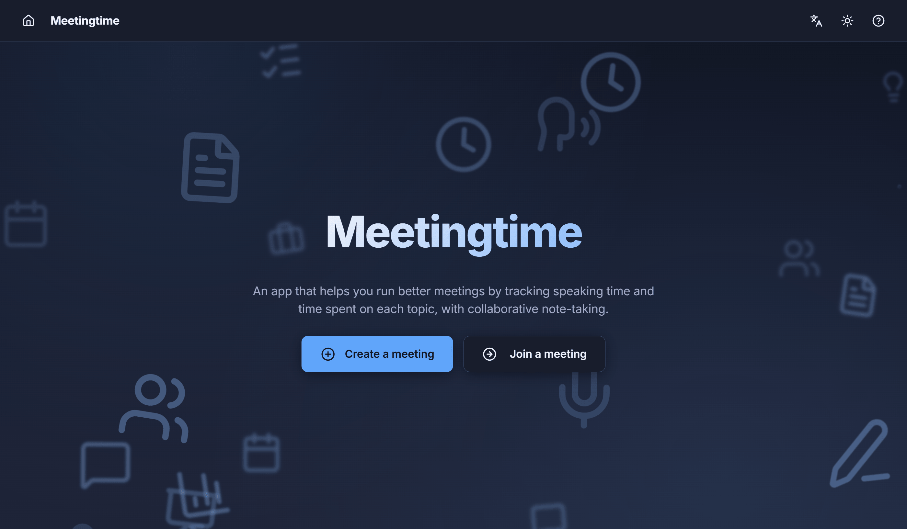
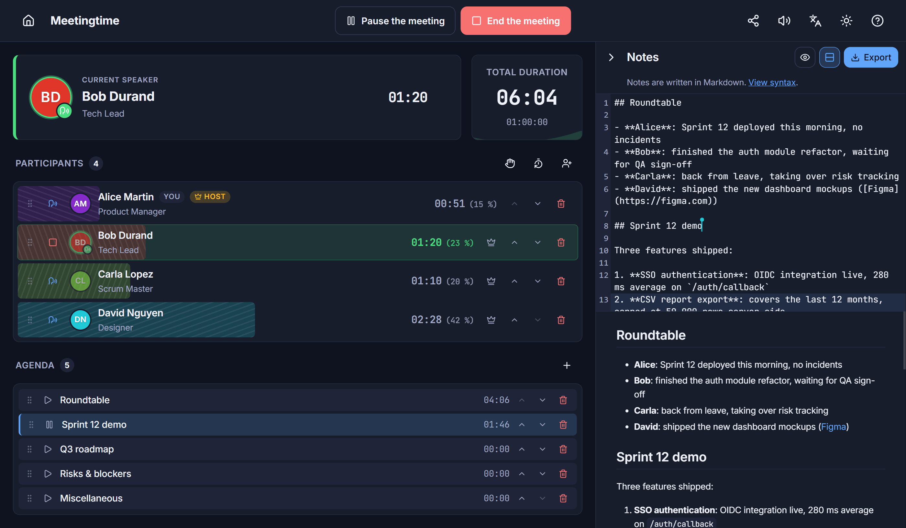

# Meetingtime

[](./LICENSE)
[](https://github.com/qiaeru/meetingtime/releases)
[](https://github.com/qiaeru/meetingtime/pkgs/container/meetingtime)
[](https://github.com/qiaeru/meetingtime/stargazers)

A self-hosted real-time web app that helps you run better meetings by tracking speaking time and time spent on each topic, with collaborative note-taking.

Hosts create a meeting in one click, share a short identifier (or a direct join link with an optional password), and see in real time who has spoken, for how long, which topic is currently active, and who is raising their hand. The notes panel lets every co-host edit a shared Markdown document with live remote cursors and syntax-highlighted code blocks, and exports the result as a single `.md` file at the end.

> **Ephemeral by design.** No database, no telemetry, no external network call at runtime. Meeting state lives in server memory and is wiped a few minutes after the host ends the meeting.

| Home | Live meeting |
| :--: | :----------: |
|  |  |
| *The home screen with create / join actions and the language picker* | *A meeting in progress with the speaker spotlight, agenda and collaborative notes* |

## Highlights

### What it does

- **Speaking-time accountability.** The host grants or revokes the floor in one click, or participants take and release it themselves from their device; the current speaker's chronometer is visible to everyone. An optional per-turn time-box shifts the timer from green to orange to red with discreet audio warnings as the limit approaches and once it is exceeded.
- **Live agenda.** Topics get their own chronometer, can be reordered live, and the currently active topic is highlighted across every participant's view.
- **Raise-hand queue.** Participants signal they want to speak; the host sees a full-width banner with the queue and grants the floor in one click.
- **Join from a phone.** Participants get a focused mobile view to take the floor, raise their hand and follow the speaker, the meeting timer and the current topic, with the screen kept awake and optional vibration. The host runs the full dashboard on a large screen.
- **Collaborative Markdown notes.** Co-hosts edit a shared document with live remote cursors (Yjs CRDT). Fenced code blocks are syntax-highlighted via Shiki. Guests see the notes in read-only. The full notes plus per-topic and per-speaker stats are exported as a single `.md` file at the end.
- **Five languages out of the box.** English, French, Spanish, Italian, German. PWA manifest content-negotiated per locale.

### Under the hood

- **Backend.** Node.js 24, Express 5, Socket.IO and Yjs in a single process. No database: meeting state lives in server memory and is garbage-collected after a configurable idle timeout, plus a faster wipe after the host ends the meeting.
- **Frontend.** Vanilla TypeScript with Vite, CodeMirror 6 for the editor, Shiki bundled for syntax highlighting, no UI framework. Components are plain functions returning an `{ el, update, tick, destroy }` handle; the meeting view is driven by a single 500 ms ticker.
- **Real-time.** Two WebSocket channels share the same port: Socket.IO for meeting commands and full-state broadcasts, a minimal y-websocket bridge for the CRDT notes.
- **Self-contained.** Fonts (Inter, JetBrains Mono) self-hosted, syntax-highlighting grammars bundled at build time, zero CDN, zero analytics. Runs unmodified on an air-gapped host.
- **Hardened.** Strict CSP, per-IP and per-socket rate limits, constant-time-ish password compare, origin check on every WebSocket upgrade, force-disconnect on participant removal, graceful shutdown on `SIGTERM`. Runs as a non-root user in the container.
- **Ready for public release.** MIT licensed, license check in CI (root + server + client), Dependabot, GitHub Actions CI, multi-arch (amd64 + arm64) GHCR releases.

## Quick start

```bash
docker run --rm -p 3000:3000 ghcr.io/qiaeru/meetingtime:latest
```

Open <http://localhost:3000>, click **Create a meeting**, share the displayed ID with your participants. For a production setup with HTTPS, pick one of the three variants under [`deploy/`](./deploy/).

## HTTPS deployments

Three ready-to-use Compose variants live in [`deploy/`](./deploy/):

- [Caddy](./deploy/caddy/README.md) is the simplest option, with automatic Let's Encrypt certificates.
- [Traefik](./deploy/traefik/README.md) uses label-based routing and fits well alongside other services.
- [nginx](./deploy/nginx/README.md) is for hosts that already run nginx with their own certbot pipeline.

## Documentation

- [Architecture](./docs/architecture.md)
- [Deployment](./docs/deployment.md) and [configuration](./docs/configuration.md)
- [Security](./docs/security.md)
- [Accessibility](./docs/accessibility.md)
- [Keyboard shortcuts](./docs/keyboard.md)
- [Internationalisation](./docs/i18n.md)
- [Meeting templates (JSON)](./docs/meeting_import.md)
- [Development](./docs/development.md)
- [Contributing](./CONTRIBUTING.md)
- [Changelog](./CHANGELOG.md)

## Credits

Third-party libraries and their licences are listed in [CREDITS.md](./CREDITS.md).

## License

Released under the MIT License. See [LICENSE](./LICENSE) for the full text.
